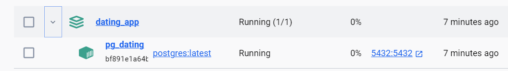
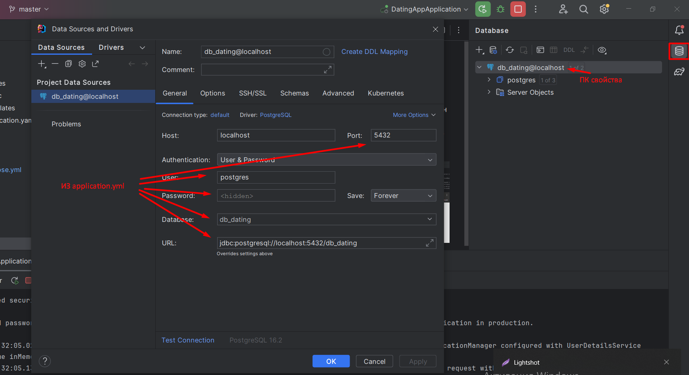
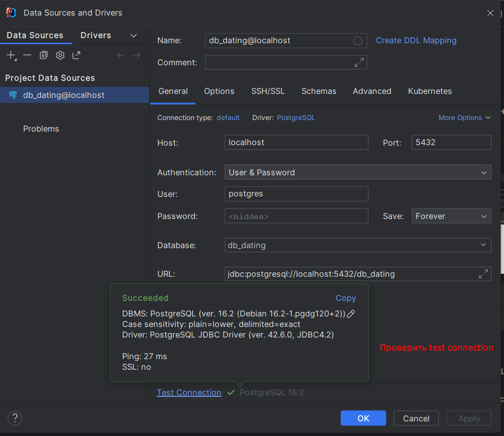
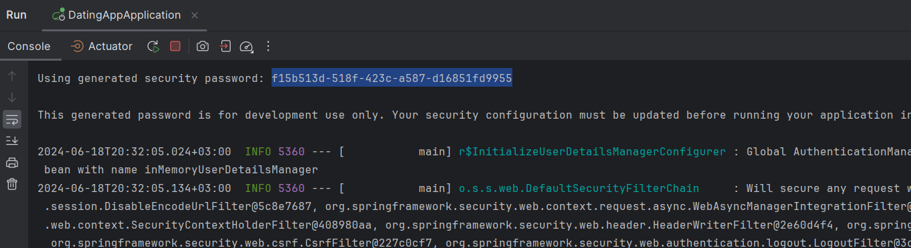
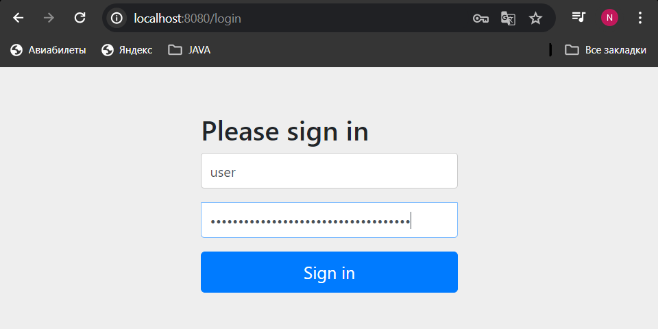
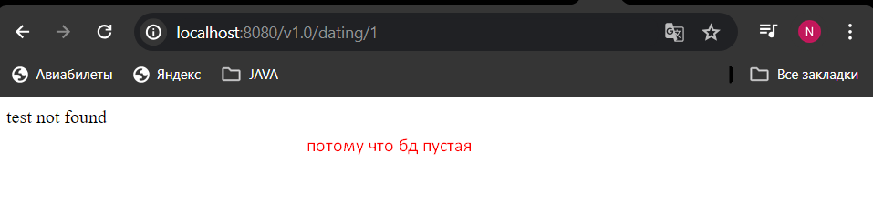

скачать докер  
в командной строке  
`docker-compose up -d`  

коннекшн к бд

по локал хосту буешь стучаться, надо ввести логин и пароль (скрины)  
либо просто закомментить в градле зависимость сприн секьюрити

